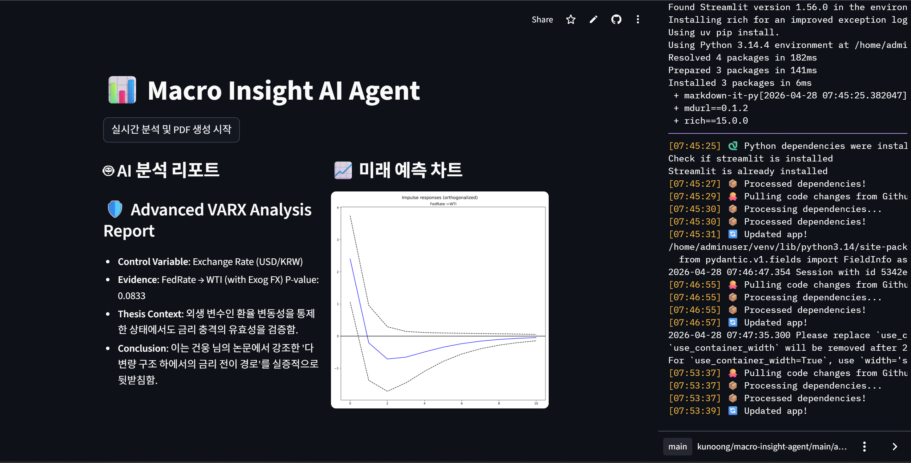

# 📊 Macro Insight AI Agent (v2.0: VARX-IRF Engine)
 
**Advanced Macroeconomic Analysis with Exogenous Control & Impulse Response Analysis**
 
> Operationalizing econometric theory (VARX-IRF) into a production-ready AI Agent system.
 
🔗 **Live Demo**: [macro-insight-agent-36u7rxpwgjksqvqbdzzugu.streamlit.app](https://macro-insight-agent-36u7rxpwgjksqvqbdzzugu.streamlit.app)
 
---
 
## 📌 Overview
 
This project bridges theoretical econometrics and modern Agentic AI. It implements a **VARX (Vector Autoregression with Exogenous Variables)** model to analyze the dynamic relationship between interest rates and energy costs, controlled by currency fluctuations — directly extending the methodology from my undergraduate thesis on Korean used-car export markets.
 
---
 
## 🚀 Key Technical Features
 
| Feature | Detail |
|---------|--------|
| **VARX Modeling** | Incorporates Exchange Rate (USD/KRW) as exogenous variable to isolate pure interest rate shocks |
| **Impulse Response Function** | Tracks how a 1-unit FedRate shock propagates over a 10-month horizon |
| **Granger Causality Test** | Statistically validates leading indicators (FedRate → WTI, p-value = 0.0833) |
| **Agentic Workflow** | LangGraph orchestrates data acquisition, statistical estimation, and visualization |
| **Automated Reporting** | PDF report generation via FPDF |
| **Live Data** | Real-time macroeconomic indicators via FRED API (FedRate, WTI, USD/KRW) |
 
---
 
## 📈 Statistical Framework
 
$$\mathbf{y}_t = \mathbf{c} + \sum_{i=1}^p \mathbf{A}_i \mathbf{y}_{t-i} + \mathbf{B} \mathbf{x}_t + \mathbf{\epsilon}_t$$
 
Where $\mathbf{y}_t = [\text{FedRate}_t, \text{WTI}_t]'$ and $\mathbf{x}_t = [\text{USD/KRW}_t]'$
 
---
 
## 📊 Analysis Results
 
| Metric | Result |
|--------|--------|
| Granger Causality (FedRate → WTI) | p-value = **0.0833** |
| Control Variable | USD/KRW Exchange Rate |
| IRF Horizon | 10 months |
| Data Source | FRED API (real-time) |
 

 
---
 
## 🏗️ System Architecture
 
```
User Input
    ↓
LangGraph Agent (Orchestrator)
    ↓
┌─────────────────────────────────┐
│  Node 1: FRED API Data Fetch    │
│  Node 2: VARX Model Estimation  │
│  Node 3: Granger Causality Test │
│  Node 4: IRF Visualization      │
│  Node 5: PDF Report Generation  │
└─────────────────────────────────┘
    ↓
Streamlit Dashboard Output
```
 
---
 
## 📂 Project Structure
 
```
macro-insight-agent/
├── agent.py          # LangGraph agent workflow
├── app.py            # Streamlit UI
├── main.py           # Core VARX-IRF engine
├── requirements.txt
├── .gitignore        # .env security management
└── README.md
```
 
---
 
## 🛠️ Tech Stack
 
| Category | Technology |
|----------|-----------|
| Agent Framework | LangGraph |
| Econometrics | statsmodels (VAR, VARX, Granger) |
| Data Pipeline | FRED API |
| Visualization | Matplotlib |
| UI | Streamlit |
| Reporting | FPDF |
| Language | Python 3.14 |
 
---
 
## 🔧 Troubleshooting & Engineering Notes
 
- **FPDF Unicode Error**: Resolved by adopting full English output strategy, ensuring cross-platform compatibility
- **statsmodels API Versioning**: Debugged `exog` parameter declaration differences across versions to complete VARX implementation
- **Git Rebase**: Managed remote repository synchronization and `.env` security file exclusion
---
 
## 🎓 About
 
Senior at **Hankuk University of Foreign Studies**, double majoring in Statistics and Computer Science. This project operationalizes the VARX-IRF methodology from my undergraduate thesis on macroeconomic shocks in Korean used-car export markets into a functional AI agent system.
 
---
 
*Last updated: April 2026*
